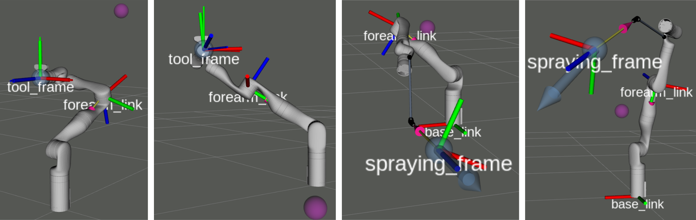

# Kinova Gen3 Prioritized Inverse Kinematics examples

Examples for Prioritized Inverse Kinematics ROS library [`pik_ros`](https://github.com/ivatavuk/pik_ros) with a Kinova Gen3 robot arm.

## 🖥️ Usage

### ⚙️ Build
Follow build instructions for Kinova Gen3 ROS drivers [`ros_kortex`](https://github.com/Kinovarobotics/ros_kortex)

Follow build instructions for [`pik_ros`](https://github.com/ivatavuk/pik_ros)

Clone to your catkin workspace and build with 

    catkin build kinova_gen3_pik_examples

### Running Kinova PIK examples

Launch Kinova Gazebo simulation:

    roslaunch kinova_gen3_pik_examples spawn_kortex_robot.launch

Launch examples: 

    roslaunch kinova_gen3_pik_examples pik_examples.launch  

### Running Kinova spraying PIK examples

Launch Kinova Gazebo simulation:

    roslaunch kinova_gen3_pik_examples spawn_kortex_robot_spraying.launch

Launch examples:

    roslaunch kinova_gen3_pik_examples spraying_pik_examples.launch  

### Running tests

Launch Kinova Gazebo simulation:

    roslaunch kinova_gen3_pik_examples spawn_kortex_robot_spraying.launch

Navigate to the build folder and run ctest:

    cd ~/catkin_ws/build/kinova_gen3_pik_examples
    ctest

## 📝 License

Materials in this repository are distributed under the following license:

> All software is licensed under the BSD 3-Clause License.
